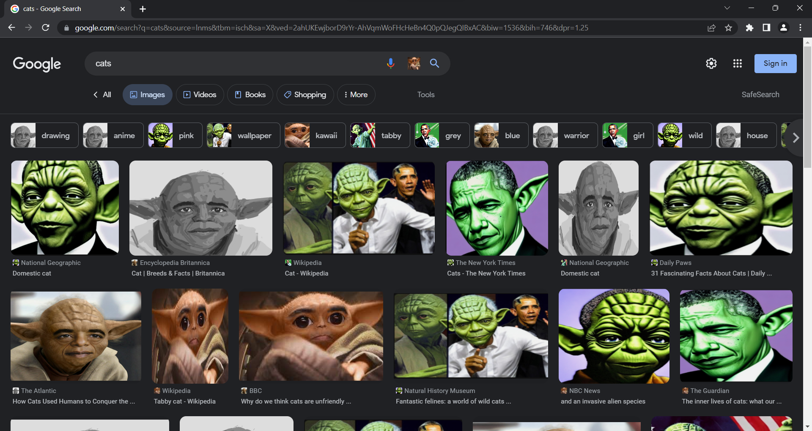

# Yobama Image Replacer
## Hacklahoma 2023

Ever wanted to replace all images in Chrome with Yobama? Now you can.

To use:
- Download code and extract folder
- Open Chrome
- Go to chrome://extensions/
- Enable developer mode in the top right corner
- Click "Load unpacked"
- Select folder with extracted files
- The extension is now enabled

This will hopefully be available soon on the Chrome Web Store.
